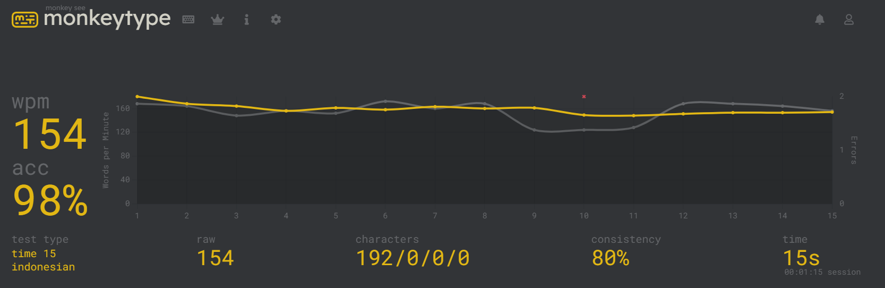

I’m a 3rd-year undergraduate cybersecurity student at Binus University, passionate about CTF competitions, bug bounty hunting, and exploring Web3 programming and security.

My goal is to improve my skills and share what I learn through write-ups and projects.

**Fun fact:** I am fast at typing, this is my 15 secs attempt :)

**Record for 1 Minutes**
- English: 137 WPM @ 94% accuracy  
- Indonesian: 146 WPM @ 96% accuracy

